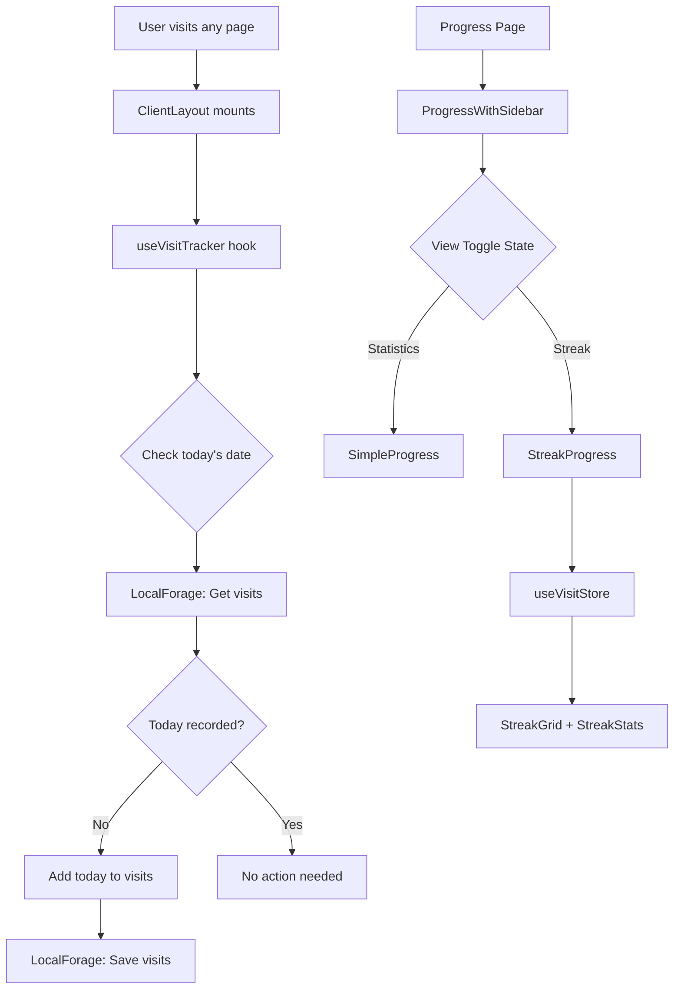

# Design Document: Visit Streak Tracker

## Overview

The Visit Streak Tracker feature adds a GitHub-style contribution/activity visualization to the Progress page in KanaDojo. It tracks daily visits using LocalForage for persistent storage and displays the visit history across three time periods: 7 days, 30 days, and yearly view. Users can toggle between the existing statistics view and the new streak view.

## Architecture

The feature follows the existing feature-based architecture pattern used in KanaDojo:

```
features/Progress/
├── components/
│   ├── ProgressWithSidebar.tsx  (modified - add toggle)
│   ├── SimpleProgress.tsx       (existing)
│   ├── StreakProgress.tsx       (new - main streak view)
│   ├── StreakGrid.tsx           (new - grid visualization)
│   └── StreakStats.tsx          (new - summary statistics)
├── store/
│   ├── useStatsStore.ts         (existing)
│   └── useVisitStore.ts         (new - visit tracking store)
├── hooks/
│   └── useVisitTracker.ts       (new - tracking hook)
├── lib/
│   └── streakCalculations.ts    (new - pure calculation functions)
└── index.ts                     (modified - export new components)
```

### Data Flow



## Components and Interfaces

### 1. useVisitStore (Zustand Store)

```typescript
interface VisitState {
  visits: string[]; // Array of "YYYY-MM-DD" date strings
  isLoaded: boolean;

  // Actions
  loadVisits: () => Promise<void>;
  recordVisit: (date: string) => Promise<void>;
  getVisits: () => string[];
}
```

### 2. useVisitTracker Hook

A hook that runs on app mount to record the current day's visit:

```typescript
function useVisitTracker(): void;
```

- Runs once per app session
- Checks if today is already recorded
- Records today's date if not present

### 3. StreakProgress Component

Main container for the streak visualization:

```typescript
interface StreakProgressProps {
  // No props - uses store directly
}
```

### 4. StreakGrid Component

Renders the calendar grid for different time periods:

```typescript
type TimePeriod = '7days' | '30days' | 'year';

interface StreakGridProps {
  visits: string[];
  period: TimePeriod;
}
```

### 5. StreakStats Component

Displays summary statistics:

```typescript
interface StreakStatsProps {
  visits: string[];
}

interface StreakStatistics {
  totalVisits: number;
  currentStreak: number;
  longestStreak: number;
}
```

### 6. Streak Calculation Functions

Pure functions for calculating streak data:

```typescript
// Get current consecutive day streak
function calculateCurrentStreak(visits: string[]): number;

// Get longest streak ever achieved
function calculateLongestStreak(visits: string[]): number;

// Get days for a specific time period
function getDaysInPeriod(period: TimePeriod, referenceDate: Date): string[];

// Check if a date has a visit
function hasVisit(visits: string[], date: string): boolean;

// Format date to YYYY-MM-DD
function formatDate(date: Date): string;

// Parse YYYY-MM-DD to Date
function parseDate(dateString: string): Date;
```

## Data Models

### Visit Data Structure

```typescript
// Stored in LocalForage under key "kanadojo-visits"
type VisitData = string[]; // ["2025-11-28", "2025-11-27", "2025-11-25", ...]
```

### Date Format

All dates are stored and processed in ISO format: `YYYY-MM-DD`

- Example: `"2025-11-28"`
- Timezone: User's local timezone (using `toISOString().split('T')[0]` equivalent)

## Correctness Properties

_A property is a characteristic or behavior that should hold true across all valid executions of a system-essentially, a formal statement about what the system should do. Properties serve as the bridge between human-readable specifications and machine-verifiable correctness guarantees._

### Property 1: Visit Idempotence

_For any_ sequence of visit recordings on the same calendar day, the stored visits array SHALL contain exactly one entry for that day.
**Validates: Requirements 1.2**

### Property 2: Visit Serialization Round-Trip

_For any_ valid visits array, serializing to LocalForage and deserializing back SHALL produce an equivalent array.
**Validates: Requirements 1.4, 1.5**

### Property 3: Date Format Consistency

_For any_ stored visit date, the date string SHALL match the pattern `YYYY-MM-DD` (regex: `^\d{4}-\d{2}-\d{2}$`).
**Validates: Requirements 1.3**

### Property 4: 7-Day View Cell Count

_For any_ reference date, the 7-day view SHALL produce exactly 7 day entries representing the last 7 calendar days including the reference date.
**Validates: Requirements 3.1**

### Property 5: 30-Day View Cell Count

_For any_ reference date, the 30-day view SHALL produce exactly 30 day entries representing the last 30 calendar days including the reference date.
**Validates: Requirements 4.1**

### Property 6: Yearly View Coverage

_For any_ reference date, the yearly view SHALL produce day entries for approximately 365 days organized into 12 month groups.
**Validates: Requirements 5.1, 5.2**

### Property 7: Visit Indicator Correctness

_For any_ visits array and any day in the display period, the day cell SHALL show a filled indicator if and only if that day exists in the visits array.
**Validates: Requirements 3.2, 3.3**

### Property 8: Current Streak Calculation

_For any_ visits array, the current streak SHALL equal the count of consecutive days ending at today (if visited today) or yesterday (if not visited today but visited yesterday), and SHALL be 0 if neither condition is met.
**Validates: Requirements 6.1, 6.4**

### Property 9: Longest Streak Calculation

_For any_ visits array, the longest streak SHALL equal the maximum consecutive day sequence found in the entire visit history.
**Validates: Requirements 7.2**

### Property 10: Total Visits Count

_For any_ visits array, the total visits count SHALL equal the length of the unique dates in the visits array.
**Validates: Requirements 7.1**

## Error Handling

### LocalForage Errors

- If LocalForage fails to load, initialize with empty visits array
- If LocalForage fails to save, log error but don't crash the app
- Gracefully degrade to in-memory storage if persistent storage unavailable

### Invalid Data

- If stored data is not a valid array, reset to empty array
- If date strings are malformed, filter them out during load
- Log warnings for data integrity issues

### Edge Cases

- First-time user: Empty visits array, all indicators show empty
- User with no visits in display period: Show empty grid with proper labels
- Timezone changes: Use local date consistently

## Testing Strategy

### Property-Based Testing Library

The project will use **fast-check** for property-based testing in TypeScript/JavaScript.

### Unit Tests

Unit tests will cover:

- Component rendering with various visit data states
- Toggle switch functionality
- Edge cases like empty visits, single visit, all days visited

### Property-Based Tests

Each correctness property will be implemented as a property-based test:

- Tests will run a minimum of 100 iterations
- Each test will be tagged with the format: `**Feature: visit-streak-tracker, Property {number}: {property_text}**`
- Generators will create random visit arrays with dates spanning various ranges

### Test Structure

```
features/Progress/
├── __tests__/
│   ├── streakCalculations.test.ts      (unit + property tests for pure functions)
│   ├── useVisitStore.test.ts           (store behavior tests)
│   └── StreakGrid.test.tsx             (component rendering tests)
```

### Key Test Scenarios

1. Empty visit history
2. Single visit (today)
3. Consecutive days streak
4. Gaps in visit history
5. Full year of visits
6. Boundary dates (month/year transitions)
