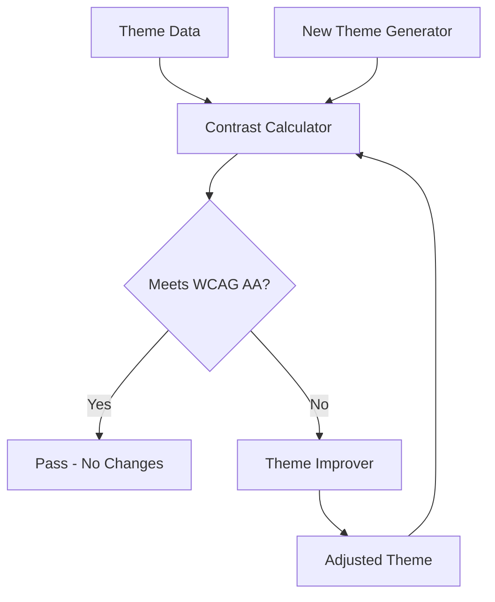

# Design Document: WCAG Theme Accessibility

## Overview

This design document outlines the approach for auditing and improving the KanaDojo theme system to ensure WCAG (Web Content Accessibility Guidelines) compliance. The system contains 80+ color themes that will be evaluated against accessibility standards, improved where necessary, and expanded with 8 new accessible themes.

## Architecture

The theme accessibility system consists of:

1. **Contrast Calculation Utilities** - Functions to compute WCAG contrast ratios
2. **Theme Validator** - Validates themes against accessibility requirements
3. **Theme Improver** - Adjusts non-compliant themes while preserving aesthetics
4. **New Theme Generator** - Creates new accessible themes with variety



## Components and Interfaces

### Color Utility Functions

```typescript
// Convert HSL/RGB/Hex to relative luminance
function getRelativeLuminance(color: string): number;

// Calculate WCAG contrast ratio between two colors
function getContrastRatio(color1: string, color2: string): number;

// Parse any color format to RGB
function parseColor(color: string): { r: number; g: number; b: number };

// Adjust lightness while preserving hue and saturation
function adjustLightness(
  color: string,
  targetContrast: number,
  background: string
): string;
```

### Theme Validator Interface

```typescript
interface ValidationResult {
  themeId: string;
  isValid: boolean;
  issues: {
    property: string;
    actualRatio: number;
    requiredRatio: number;
    background: string;
  }[];
}

function validateTheme(theme: Theme): ValidationResult;
function validateAllThemes(themes: Theme[]): ValidationResult[];
```

## Data Models

### Theme Structure (Existing)

```typescript
interface Theme {
  id: string;
  backgroundColor: string; // Primary background
  cardColor: string; // Card/container background
  borderColor: string; // Border color
  mainColor: string; // Primary text/accent
  secondaryColor: string; // Secondary accent
}
```

### Contrast Requirements Matrix

| Foreground     | Background      | Min Ratio | WCAG Level | Purpose            |
| -------------- | --------------- | --------- | ---------- | ------------------ |
| mainColor      | backgroundColor | 4.5:1     | AA         | Normal text        |
| mainColor      | cardColor       | 4.5:1     | AA         | Text on cards      |
| secondaryColor | backgroundColor | 4.5:1     | AA         | Secondary text     |
| secondaryColor | cardColor       | 4.5:1     | AA         | Secondary on cards |
| borderColor    | backgroundColor | 3:1       | AA         | UI boundaries      |
| borderColor    | cardColor       | 1.5:1     | -          | Card boundaries    |
| cardColor      | backgroundColor | 1.1:1     | -          | Visual distinction |

## WCAG Accessibility Standards Reference

### Contrast Ratio Calculation Formula

The WCAG contrast ratio is calculated as:

```
Contrast Ratio = (L1 + 0.05) / (L2 + 0.05)
```

Where L1 is the relative luminance of the lighter color and L2 is the relative luminance of the darker color.

### Relative Luminance Formula

```
L = 0.2126 * R + 0.7152 * G + 0.0722 * B
```

Where R, G, B are linearized values:

- If sRGB value ≤ 0.03928: linear = sRGB / 12.92
- If sRGB value > 0.03928: linear = ((sRGB + 0.055) / 1.055) ^ 2.4

### WCAG 2.1 Contrast Requirements

| Level | Normal Text | Large Text | UI Components |
| ----- | ----------- | ---------- | ------------- |
| AA    | 4.5:1       | 3:1        | 3:1           |
| AAA   | 7:1         | 4.5:1      | 4.5:1         |

### Color Blindness Considerations

1. **Protanopia** (red-blind): Avoid red-green only distinctions
2. **Deuteranopia** (green-blind): Avoid red-green only distinctions
3. **Tritanopia** (blue-blind): Avoid blue-yellow only distinctions

**Solution**: Always ensure sufficient luminance contrast (2:1 minimum) between accent colors, not just hue difference.

## Correctness Properties

_A property is a characteristic or behavior that should hold true across all valid executions of a system-essentially, a formal statement about what the system should do. Properties serve as the bridge between human-readable specifications and machine-verifiable correctness guarantees._

### Property 1: Text Color Contrast Compliance

_For any_ theme in the system, the mainColor and secondaryColor SHALL have a contrast ratio of at least 4.5:1 against both backgroundColor and cardColor.

**Validates: Requirements 1.1, 1.2, 1.3, 1.4**

### Property 2: Border Visibility Compliance

_For any_ theme in the system, the borderColor SHALL have a contrast ratio of at least 3:1 against backgroundColor and at least 1.5:1 against cardColor.

**Validates: Requirements 1.5, 2.2**

### Property 3: Card Distinction

_For any_ theme in the system, the cardColor SHALL have a contrast ratio of at least 1.1:1 against backgroundColor to ensure visual distinction.

**Validates: Requirements 2.1**

### Property 4: Accent Color Distinguishability

_For any_ theme in the system, the mainColor and secondaryColor SHALL have either a hue difference of at least 30° OR a luminance contrast ratio of at least 2:1.

**Validates: Requirements 2.3, 3.2**

### Property 5: Color Blindness Safety

_For any_ theme where mainColor is in the red hue range (330°-30°) and secondaryColor is in the green hue range (90°-150°), or vice versa, the luminance contrast between them SHALL be at least 3:1.

**Validates: Requirements 3.1**

### Property 6: Color Harmony

_For any_ new theme, the mainColor and secondaryColor hue relationship SHALL fall within one of: complementary (180° ± 30°), analogous (≤ 60°), or triadic (120° ± 30°).

**Validates: Requirements 4.2**

### Property 7: New Theme Uniqueness

_For any_ new theme added to the system, the combined color distance from all existing themes SHALL exceed a minimum threshold to ensure visual distinctness.

**Validates: Requirements 6.3**

## Error Handling

1. **Invalid Color Format**: If a color string cannot be parsed, log error and skip theme
2. **Impossible Contrast**: If required contrast cannot be achieved without changing hue, flag for manual review
3. **Color Clipping**: If lightness adjustment exceeds 0-100% bounds, clamp and warn

## Testing Strategy

### Unit Tests

- Test contrast ratio calculation with known color pairs
- Test relative luminance calculation with standard colors
- Test color parsing for HSL, HSLA, RGB, and hex formats
- Test lightness adjustment function

### Property-Based Tests

Using a property-based testing library (fast-check for TypeScript):

1. **Property 1 Test**: Generate random themes, verify all text-on-background contrast ratios ≥ 4.5:1
2. **Property 2 Test**: Generate random themes, verify border contrast ratios meet thresholds
3. **Property 3 Test**: Generate random themes, verify card-background distinction
4. **Property 4 Test**: Generate random themes, verify accent color distinguishability
5. **Property 5 Test**: Generate themes with red-green combinations, verify luminance safety
6. **Property 6 Test**: Generate new themes, verify color harmony relationships
7. **Property 7 Test**: Generate new themes, verify uniqueness from existing themes

Each property-based test SHALL:

- Run a minimum of 100 iterations
- Be tagged with format: `**Feature: wcag-theme-accessibility, Property {N}: {description}**`
- Reference the specific correctness property being validated

### Integration Tests

- Validate all 80+ existing themes against requirements
- Verify improved themes maintain original aesthetic intent (manual review)
- Verify 8 new themes meet all requirements
